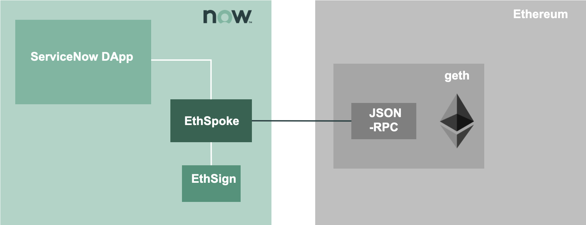

# ethnow - The Ethereum integration for ServiceNow

ethnow aims to create a production-ready Ethereum integration for ServiceNow. 

The integration works with the public Ethereum networks as well as private networks based on Ethereum compatible software like Consensys Quorum and Hyperledger Besu.

The spoke is focused on the implementation of an integration that works on ServiceNow server-side, but the application contains example of integration on the client-side (where any type of integration library eg web3js, ethjs, ethers can be included in the ServiceNow front-end, including MetaMask injected web3js) 

All modules can operate in a totally self-contained way withing the ServiceNow instance, without the need of any external component, including the MID server.

The project contains the following repositories:
- ethsign. A signer based on the ServiceNow platform.
- ethspoke. The Ethereum spoke, that used ethsign to sign transaction and to provision cryptographic key pairs to ServiceNow users
- nowtoken. An example application that is based on ethnow and that implement a token NOW that can be exchanged within and across customer instances.

## Architecture

EthNow is made of two scoped applications for ServiceNow
- ethsign, which is an Ethereum signer built in ServiceNow
- ethspoke, which is the actual integration application that can enable an ecosystem of ServiceNow based DApps, enabling blockchain users and developers to leverage the low-code capabilities of the Now Platform

In the diagram below, the high-level architecture is represented, where a ServiceNow Dapp interact with the Ethereum node through ethspoke. Ethspoke uses ethsign in order to sign transactions and talk with the node via JSON-RPC APIs. Multiple instances can connect to different blockchain nodes, that will need to reach consensus for state-changing interactions. 

ServiceNow Dapp (distributed applications) can be developed leveraging ethnow. As part of the ethnow project a sample NowToken application.

Three types of interactions are implemented by ethspoke:
- Deploy Smart Contract
- Invoke method (send)
- Call method (call)

## Description

The ethnow project uses the primitives provided by the [ethjs](https://github.com/ethjs) project.

The following libraries have been adapted/polyfilled to the ServiceNow javascript engine (Rhino 1.7R5 as of the Paris release) and embedded in the applications as script include:

| Library | Purpose |
|---|---|
|ethjs-signer| Sign Ethereum transactions|
|ethjs-account| Generate key pairs and manage accounts|
|ethjs-abi| Encoding and decoding utilities|
|ethjs-format| Payload formatter for the Ethereum RPC layer |
|---|---|

The ethnow spoke talk with the Ethereum node(s) through the node JSON-RPC API.

## How to install 

## How to use

## How to contribute

